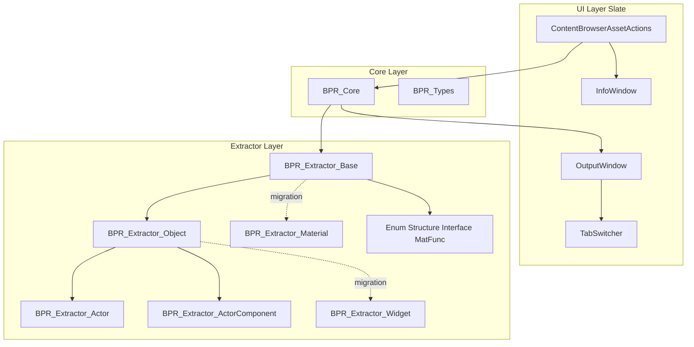

# Architecture — BlueprintReader

Target design and migration status for the Editor plugin.

## Overview

Three layers:



## Layer 1: Module

`FBlueprintReaderModule` — plugin lifecycle, creates `BPR_Core` and UI, registers Content Browser menu.

**Target:** call `BPR_Core::RegisterAllExtractors()` on startup.

## Layer 2: Core

`BPR_Core` — extractor factory. Selects handler by `CanHandleAsset()` + `GetPriority()`.

**Data contract:**

```cpp
struct FBPR_ExtractedData {
    FText Structure, Graph, Design;
    EAssetType AssetType;
};
```

| Method | Role |
|--------|------|
| `RegisterAllExtractors()` | Register and sort extractors |
| `IsSupportedAsset()` | Any extractor can handle asset |
| `ExtractAsset()` | Run best extractor |
| `GetUnsupportedAssetInfo()` | UI for unsupported types |

**Migration (M1):** Core factory exists; wiring to module and UI is in progress.

## Layer 3: Extractors

### Target hierarchy

```
BPR_Extractor_Base
├── BPR_Extractor_Object
│   ├── BPR_Extractor_Actor          (priority ~100)
│   ├── BPR_Extractor_ActorComponent (priority ~90)
│   ├── BPR_Extractor_Widget         (priority ~80)
│   └── BPR_Extractor_Interface      (priority ~70)
├── BPR_Extractor_Enum, Structure    (priority ~50)
├── BPR_Extractor_Material           (priority ~40)
└── BPR_Extractor_MaterialFunction   (priority ~30)
```

**Principle:** more specific extractors win over generic ones.

`BPR_Extractor_Object` shares Blueprint graph logic (variables, K2 traversal, formatting).  
Specialized extractors extend structure output (components, widget tree, etc.).

**Legacy (being integrated):** Widget and Material extractors were standalone; migrating into the hierarchy (M1–M3).

### Design choices

- Extractors are **plain C++** (not `UObject`) — owned via `TUniquePtr` in Core
- Default output: `EOutputFormat::Minimal` (LLM-friendly Markdown)
- `bUseUnity = false` in Build.cs — intentional for reliable incremental builds

## Layer 4: UI

| Component | Role |
|-----------|------|
| `FBPR_ContentBrowserAssetActions` | Context menu entry |
| `BPR_OutputWindow` | Slate window |
| `SBPR_TabSwitcher` | Structure / Graph / Design tabs |
| `BPR_InfoWindow` | Unsupported asset dialog |

## Data flow (target)

```
Content Browser → ExecuteForObject
  → IsSupportedAsset? → ExtractAsset → FBPR_ExtractedData
  → OutputWindow → TabSwitcher
```

## Known technical debt

1. Duplicated graph logic in legacy Widget extractor (~800 lines until M2)
2. Dual API during migration (`Process` → `Extract`)
3. No generic Blueprint Class extractor yet
4. No plugin settings UI (output format, recursion depth)
5. No file export pipeline yet